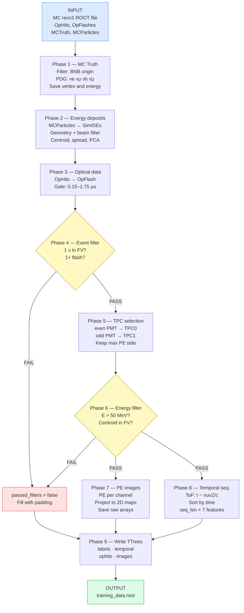

# Training Data Preparation — `NuIntNNDataPrep`

LArSoft `art::EDAnalyzer` that reads simulated SBND events and writes a ROOT file
ready for training the position, direction, and timing neural networks.

---

## Overview

The module bridges the LArSoft simulation chain and the Python training notebooks.
It extracts **MC ground-truth labels** and **raw optical detector data** from reco-stage
files and organises them into four TTrees so that each network can load only the
branches it needs.

```
MC reco1 file
(OpHits, OpFlashes, MCTruth, MCParticles)
         │
         ▼
  NuIntNNDataPrep_module.cc
         │
         ▼
  training_data.root
  ├── labels/tree      ← MC truth + energy-weighted geometry labels
  ├── temporal/tree    ← ophit sequences for LSTM / Transformer (nuvT)
  ├── ophits/tree      ← per-flash optical hit detail
  └── images/tree      ← 2D PE maps for CNN (position & direction)
```

---

## Processing pipeline



---

## Output TTrees

### `labels/tree` — always filled, lightweight
Used by all three networks to load event metadata and MC labels.

| Branch | Type | Description |
|---|---|---|
| `run`, `subrun`, `event` | `int` | Event identifier |
| `passed_filters` | `bool` | Event passed all selection cuts |
| `selected_tpc` | `int` | Selected TPC (0 = even, 1 = odd) |
| `nuv_x/y/z/t` | `vector<float>` | MC neutrino vertex position (cm) and time (ns) |
| `nuv_e` | `vector<float>` | MC neutrino energy (GeV) |
| `nuv_pdg` | `vector<int>` | Neutrino PDG code |
| `dEprom_x/y/z` | `vector<float>` | Energy-weighted centroid per TPC (cm) |
| `dEtpc` | `vector<float>` | Total deposited energy per TPC (GeV) |
| `dEdir_x/y/z` | `vector<float>` | Primary PCA eigenvector (shower direction) |
| `dEspread_x/y/z` | `vector<float>` | Std dev of energy deposit positions (cm) |
| `dEpca_lam1/2/3` | `vector<float>` | PCA eigenvalues λ₁ ≥ λ₂ ≥ λ₃ (cm²) |

### `temporal/tree` — for the LSTM / Transformer time model
Each event is a padded sequence of optical hits with 7 features each.

| Branch | Type | Description |
|---|---|---|
| `temporal_features` | `vector<float>` | Flat `[seq_len × 7]` array (see below) |
| `temporal_mask` | `vector<int>` | 1 = real hit, 0 = padding |
| `temporal_seq_len` | `int` | Fixed length = `NumFlashes × MaxOphits` |

**Feature columns per ophit** (in order):

| Index | Feature | Notes |
|---|---|---|
| 0 | `t_us` | Absolute ophit time (μs), ToF-corrected |
| 1 | `PE_raw` | Raw photoelectrons (normalised in Python) |
| 2 | `det_type` | 0=PMT coated, 1=PMT uncoated, 2=XARAPUCA VUV, 3=XARAPUCA VIS |
| 3 | `x_norm` | Optical detector X / 213.75 |
| 4 | `y_norm` | Optical detector Y / 175.00 |
| 5 | `z_norm` | (Z − 16.05) / (484.95 − 16.05) |
| 6 | `delta_t` | t_us − t_first (relative timing within event) |

### `images/tree` — for the CNN position and direction models

| Branch | Type | Description |
|---|---|---|
| `pe_per_channel` | `vector<float>[312]` | Total PE per optical channel |
| `image_uncoated` | `vector<float>` | Flattened 2D map, uncoated PMTs (`ny × nz`) |
| `image_coated` | `vector<float>` | Flattened 2D map, coated PMTs (`ny × nz`) |
| `image_ny`, `image_nz` | `int` | Image grid dimensions |
| `max_pe_uncoated/coated` | `float` | Per-image maximum PE (for normalisation) |

### `ophits/tree` — raw optical hit detail per flash

| Branch | Type | Description |
|---|---|---|
| `flash_time` | `vector<float>` | Flash AbsTime (μs) per selected flash |
| `flash_ophit_pe` | `vector<vector<float>>` | PE per ophit, per flash |
| `flash_ophit_ch` | `vector<vector<int>>` | Channel per ophit, per flash |
| `flash_ophit_time` | `vector<vector<float>>` | Peak time per ophit, per flash |

---

## How to run

```bash
lar -c fcls/run_nuint_nn_dataprep.fcl \
    -s /path/to/mc_reco1.root \
    -n 1000 \
    -o /dev/null
```

Output: `training_data.root` in the working directory.

### Key FCL parameters

| Parameter | Default | Description |
|---|---|---|
| `MCTruthOrigin` | `[1]` | 1 = BNB neutrino |
| `MCTruthPDG` | `[12,14,-12,-14]` | Neutrino PDG codes to keep |
| `OpHitsModuleLabel` | `["ophitpmt"]` | OpHit producer label |
| `OpFlashesModuleLabel` | `["opflashtpc0","opflashtpc1"]` | OpFlash producers |
| `FlashTimeWindow` | `[0.15, 1.75]` μs | Beam gate window |
| `TemporalMaxOphits` | `10` | Max ophits kept per flash |
| `TemporalNumFlashes` | `2` | Number of flashes concatenated |
| `Verbosity` | `0` | 0=quiet, 1=per-event, 2=debug |

---

## Reading the output in Python

```python
import uproot, numpy as np

f = uproot.open("training_data.root")

# Load labels (lightweight — always start here)
lab = f["labels/tree"].arrays(["passed_filters", "selected_tpc",
                                "dEprom_x", "dEprom_y", "dEprom_z",
                                "nuv_t"], library="ak")

# Load CNN images for events that passed all cuts
ok = np.array(lab["passed_filters"], dtype=bool)
img = f["images/tree"].arrays(["image_uncoated", "image_coated",
                                "image_ny", "image_nz"], library="ak")

ny = int(img["image_ny"][ok][0])
nz = int(img["image_nz"][ok][0])

import awkward as ak
u = ak.to_numpy(img["image_uncoated"][ok]).reshape(-1, ny, nz)
c = ak.to_numpy(img["image_coated"][ok]).reshape(-1, ny, nz)
images = np.stack([u, c], axis=-1)   # shape: (N, ny, nz, 2)

# Load temporal sequences for LSTM / Transformer
tmp = f["temporal/tree"].arrays(["temporal_features", "temporal_mask",
                                  "temporal_seq_len"], library="ak")
seq_len  = int(tmp["temporal_seq_len"][ok][0])
n_feat   = 7
features = ak.to_numpy(tmp["temporal_features"][ok]).reshape(-1, seq_len, n_feat)
mask     = ak.to_numpy(tmp["temporal_mask"][ok]).reshape(-1, seq_len)
```

---

## Design notes

- **Raw storage**: PE values are saved un-normalised. The normalisation factor is
  computed from the training split in Python, avoiding any leakage from validation
  or test events into the scale.
- **Four separate TTrees**: allows each network to load only the branches it needs
  without holding the full image array in memory.
- **TPC selection by PE**: the TPC whose PMTs collected more light is selected.
  For MC events the two halves are mirror-symmetric, so this gives a consistent
  labeling scheme for the single-TPC position model.
- **ToF correction**: ophit times in `temporal/tree` are shifted by `nuvZ / c`
  (speed of light = 29.98 cm/ns) to remove the neutrino propagation delay and
  align all events onto the same timing reference.
- **PCA labels**: the energy-weighted covariance matrix of Geant4 energy deposits
  is diagonalised with Eigen3. The primary eigenvector (`dEdir`) is the true
  shower axis used as the direction regression target.
