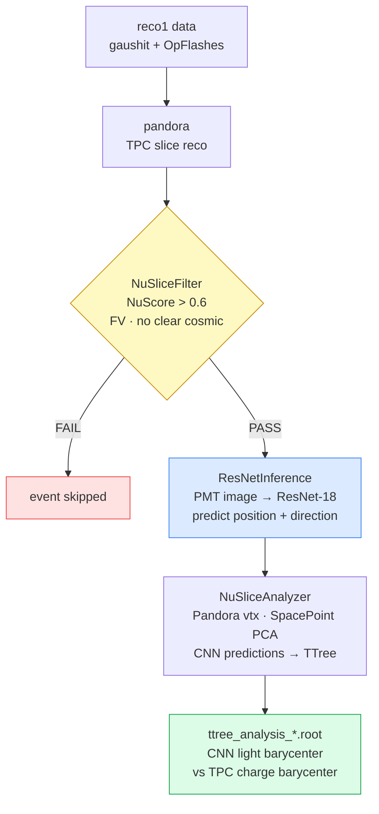
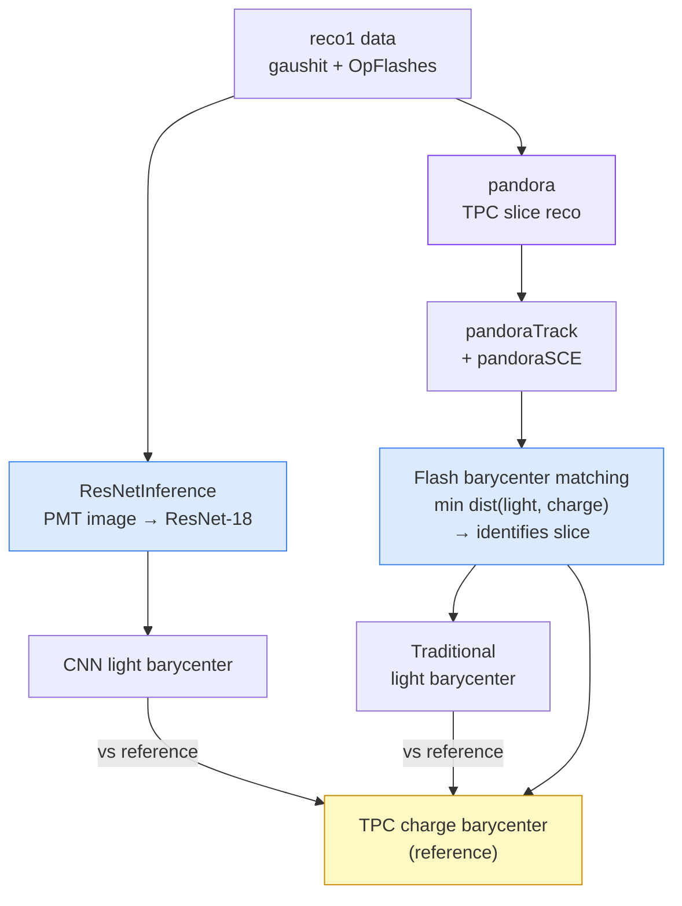

# Inference LArSoft Module

art modules that run the trained ResNet-18 inside LArSoft to reconstruct the
neutrino interaction position and direction from SBND PMT optical data.

---

## Goal

The CNN predicts the **light barycenter** (neutrino position) directly from the
2D PMT image. To evaluate how well it works, we need a reference position from
an independent source — the **TPC charge barycenter** of the neutrino slice.

Two strategies exist to obtain that reference, each with different trade-offs:

---

## Option A — High-purity neutrino selection
> `fcls/run_pos_inference_data_nuslice.fcl`

Pandora reconstructs the TPC and a dedicated filter (`NuSliceFilter`) selects
only events where one slice has a high neutrino score (NuScore > 0.6, inside FV,
not flagged as clear cosmic). This gives a clean neutrino sample with a
well-defined charge barycenter to compare against.



**Trade-off**: NuScore is itself a Pandora classifier, so this selection favours
topologies that Pandora reconstructs well (contained, clean events). The measured
CNN resolution may be optimistic for harder events.

---

## Option B — Flash barycenter matching
> `fcls/run_pos_dir_inference.fcl` + `fcls/tpcpmtbarycentermatching_only.fcl`

The flash barycenter matching tool matches each PMT OpFlash (light barycenter)
to the nearest TPC slice (charge barycenter) by minimising their 3D distance.
This identifies the neutrino slice and gives two independent position estimates
that can both be compared against the TPC charge reference in a single pipeline:



**This gives two comparisons at once:**
- `CNN light barycenter` vs `TPC charge barycenter` → CNN resolution
- `Traditional light barycenter (flash)` vs `TPC charge barycenter` → traditional reco resolution

**Trade-off**: the matching criterion *is* the distance between light and charge
barycenters. Events where the traditional reconstruction is far off are less likely
to be matched correctly, so the measured resolution for the traditional method is
biased towards well-reconstructed events, so the measured resolution underestimates the true one.
The CNN resolution is less affected since it is independent of the matching criterion.

---

## Comparison summary

| | Option A | Option B |
|---|---|---|
| **Slice selection** | Pandora NuScore filter | Flash–charge barycenter matching |
| **CNN reference** | Charge barycenter of selected slice | Charge barycenter of matched slice |
| **Traditional reco** | Not available | Flash barycenter (weighted PMT average) |
| **Selection bias** | Favours Pandora-friendly topologies | Overestimates traditional reco performance |
| **SCE correction** | No | Yes |

---

## Directory structure

```
3-inference-larsoft-module/
├── module/
│   ├── NuIntNNProducer_posdir_module.cc/hh  ← ResNet inference producer
│   ├── NuSliceFilter_module.cc              ← Pandora neutrino slice filter
│   ├── NuSliceAnalyzer_module.cc            ← Combined TTree filler
│   ├── PixelMapVars.h                       ← Data product: images + CNN predictions
│   └── classes.h / classes_def.xml          ← ROOT dictionary for PixelMapVars
├── fcls/
│   ├── run_pos_dir_inference.fcl            ← Base CNN inference FCL (PROLOG)
│   ├── run_pos_inference_data_nuslice.fcl   ← Option A: CNN + NuScore filter
│   └── tpcpmtbarycentermatching_only.fcl    ← Option B: flash barycenter matching
├── tf/
│   ├── tf_graph.cc / tf_graph.h            ← TensorFlow C++ API interface
│   └── CMakeLists.txt
├── ReadPixelMapVars.ipynb                   ← Inspect PixelMapVars art data product
└── notebooks/
    ├── inference_highneutrinopurity_data.ipynb  ← Option A analysis: CNN vs TPC barycenter (NuScore-selected events)
    └── analyze_bfm.ipynb                        ← Option B analysis: CNN + traditional vs TPC barycenter (flash matching)
```

---

## Art modules

### `NuIntNNProducer_posdir`
`art::EDProducer` — loads the ResNet-18 position and direction models via the
TensorFlow C++ API (`tf/tf_graph.cc`) and runs inference on the PMT optical data.
Produces a `PixelMapVars` data product containing the 2D PE images and CNN
predictions, and fills a TTree with per-event results.

`ProcessingMode` FCL parameter:

| Mode | Use |
|---|---|
| `DATA_inference` | Real data, no MC truth |
| `MC_inference` | MC, inference only |
| `MC_testing` | MC, also computes residuals vs MC truth |

### `NuSliceFilter`
`art::EDFilter` — selects the best neutrino-like Pandora slice per event.
Passes only if one slice satisfies: vertex in FV + `IsClearCosmic == 0` +
`NuScore > threshold` (default 0.6). Stores the selected slice ID as
`bestSliceID` for downstream modules.

### `NuSliceAnalyzer`
`art::EDAnalyzer` — reads `bestSliceID` and `PixelMapVars` and fills a combined
TTree with Pandora vertex, SpacePoint energy-weighted barycenter + PCA direction,
and CNN position/direction predictions. This TTree is the main output for
comparing CNN vs TPC reconstruction.

### `PixelMapVars`
Data product that carries the 2D PE images, per-channel PE, and CNN predictions
through the art event store so that `NuSliceAnalyzer` can read them downstream.
Only created when `SavePixelMapVars: true` in the FCL.

---

## Trained models

Models live in `../2-cnn-training-notebooks/current_models_trained/`
(see that directory's README for the full structure and how to update them).

| Directory | Task | Val performance |
|---|---|---|
| `v0419_trained_w_388k_position/` | position | mean 3D dist 17.8 cm |
| `v0419_trained_w_388k_direction_2d/` | direction | median angular error 15.2° |
| `v0415_trained_w_388k_time_lstm/` | time (LSTM) | MAE 16.1 ns |
| `v0415_trained_w_388k_time_transformer/` | time (Transformer) | MAE 15.8 ns |

The time models are used in `2-cnn-training-notebooks/TimeCoord_Training.ipynb` for evaluation
and are not yet integrated into the LArSoft inference pipeline.

FCL paths (relative to `module/`):
```
ModelPath:    "../../2-cnn-training-notebooks/current_models_trained/v0419_trained_w_388k_position/saved_model"
DirModelPath: "../../2-cnn-training-notebooks/current_models_trained/v0419_trained_w_388k_direction_2d/saved_model"
```

---

## How to run

```bash
# Option A — CNN with neutrino slice filter (data)
lar -c fcls/run_pos_inference_data_nuslice.fcl -s input_data.root

# Option A — CNN only, MC mode
lar -c fcls/run_pos_dir_inference.fcl -s input_mc.root

# Option B — Flash barycenter matching
lar -c fcls/tpcpmtbarycentermatching_only.fcl -s input_data.root
```

---

## Analysis notebooks

Two Jupyter notebooks in `notebooks/` cover the full result analysis after running the LArSoft modules:

### `notebooks/inference_highneutrinopurity_data.ipynb`
**Option A** analysis. Reads the TTree produced by `NuSliceAnalyzer` on NuScore-filtered data.
Compares CNN light barycenter vs Pandora vertex and SpacePoint charge barycenter.
Produces position and direction resolution plots for the high-purity neutrino sample.

### `notebooks/analyze_bfm.ipynb`
**Option B** analysis. Reads the output of the flash barycenter matching pipeline.
Compares CNN light barycenter **and** traditional flash barycenter both against the TPC
charge barycenter, providing a direct side-by-side resolution comparison of the two methods.
